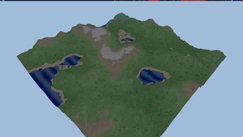

# Living Worlds

**GPU-Accelerated Terrain Simulation using Vulkan Compute Shaders**



## Overview

Living Worlds is a real-time terrain simulation engine that combines **geological processes** (erosion) with **ecological dynamics** (biome spreading) using GPU cellular automata. Built with Vulkan for maximum performance, it achieves **200+ FPS** on grids up to **3072×3072** (9.4 million cells).

## Features

| Feature | Description |
|---------|-------------|
| **Thermal Erosion** | Mass transfer based on slope thresholds |
| **9 Biome Types** | Water, Sand, Grass, Forest, Desert, Rock, Snow, Tundra, Wetland |
| **Bidirectional Feedback** | Forests reduce erosion by 80% |
| **Interactive Spawning** | Click to place biomes with adjustable radius |
| **2.5D Rendering** | Isometric view with atmospheric fog |

## Demo

[walkthrough_demo.mp4](walkthrough_demo.mp4)

## Performance

| Grid Size | Vertices | FPS |
|-----------|----------|-----|
| 512×512 | 262K | 3,062 |
| 1024×1024 | 1.0M | 1,414 |
| 2048×2048 | 4.2M | 505 |
| 3072×3072 | 9.4M | 243 |

## Architecture

```
┌─────────────┐     ┌─────────────┐     ┌─────────────┐
│ Noise Init  │ ──► │ Erosion CA  │ ──► │ Biome CA    │
│ (FBM)       │     │ (Thermal)   │     │ (9 types)   │
└─────────────┘     └──────┬──────┘     └──────┬──────┘
                           │                   │
                           ▼                   ▼
                    ┌──────────────────────────────┐
                    │      2.5D Isometric Renderer │
                    └──────────────────────────────┘
```

**Tech Stack:**
- **Language:** C++20
- **Graphics API:** Vulkan 1.3
- **Memory:** VMA (Vulkan Memory Allocator)
- **UI:** Dear ImGui
- **Windowing:** GLFW
- **Math:** GLM

## Building

```bash
# Clone
git clone https://github.com/mkhlf/livingworlds.git
cd livingworlds

# Build
mkdir build && cd build
cmake ..
make -j$(nproc)

# Run
./bin/LivingWorlds
```

**Dependencies:** Vulkan SDK, GLFW3, GLM

## Controls

| Key | Action |
|-----|--------|
| `Tab` | Toggle UI |
| `WASD` | Pan camera |
| `Q/E` | Rotate view |
| `Z/X` | Zoom in/out |
| `Space` | Pause simulation |
| `R` | Reset terrain |
| `Left Click` | Spawn selected biome |

## Documentation

- [Final Report](docs/FINAL_REPORT.md) - Technical details and benchmarks
- [Presentation](docs/Living_Worlds_Presentation_Portable.html) - Slides (open in browser)

---

*Created for CS380 GPU Programming - December 2025*
