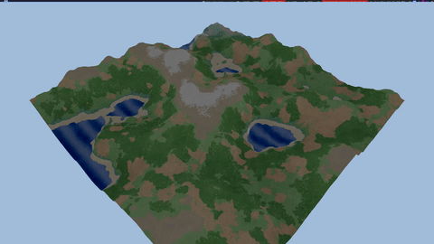
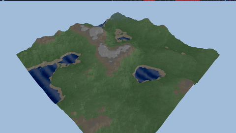
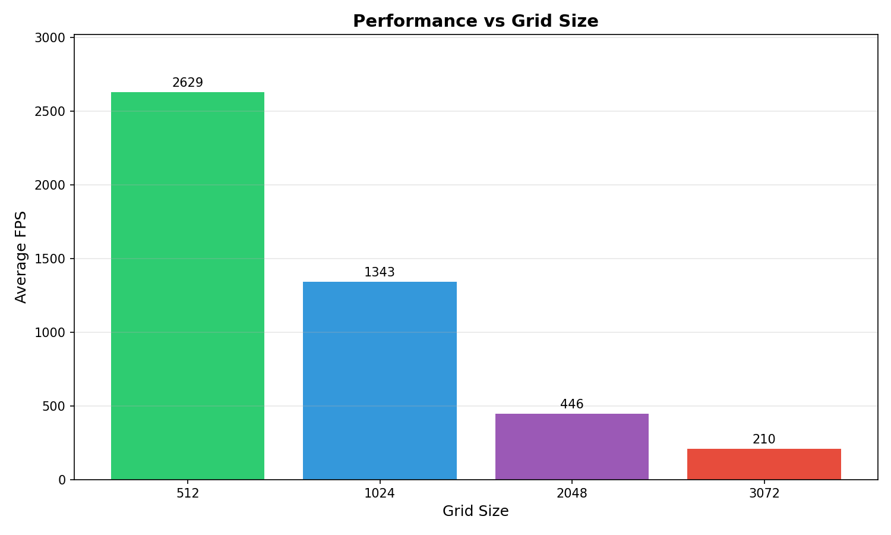
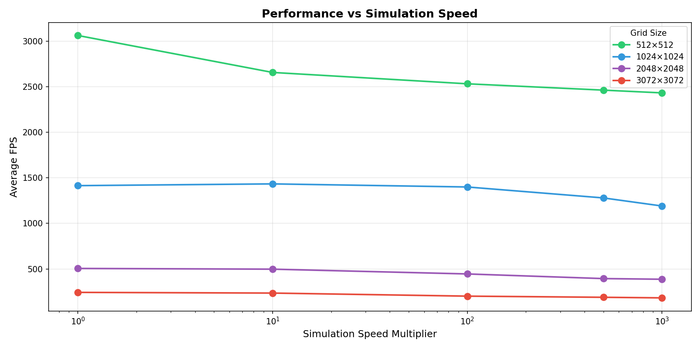

# Living Worlds: GPU-Accelerated Terrain Simulation
## CS380 GPU Programming - Final Project Report

**Author:** Mohammad Alkhalifah  
**Date:** December 2025

---

## 1. Motivation

### The Challenge
Creating realistic, dynamic terrain for games and simulations traditionally requires:
- **CPU-based procedural generation** (slow, offline)
- **Artist-created static heightmaps** (inflexible, labor-intensive)
- **Commercial tools** 

### Our Goal
Build a **real-time**, **interactive** terrain simulation that:
1. Generates terrain procedurally using cellular automata
2. Simulates geological processes (erosion) on the GPU
3. Models ecological dynamics (biome spreading)
4. Achieves **interactive framerates** for immediate feedback

---

## 2. Related Work

### Academic Foundations
| Work | Year | Contribution |
|------|------|--------------|
| Conway's Game of Life | 1970 | Foundational cellular automata |
| Jakó & Tóth | 2011 | GPU-based thermal/hydraulic erosion |
| Cordonnier et al. | 2017 | Vegetation-erosion coupling (ACM TOG) |

### Commercial Tools
- **Gaea, World Creator** - Professional terrain authoring ($200-$250)
- **Houdini** - Industry-standard procedural workflows ($4,995/year)

### Our Position
We implemented an **educational proof-of-concept** demonstrating real-time GPU terrain generation using modern Vulkan APIs, achieving performance competitive with commercial tools on smaller scales.

---

## 3. System Architecture

### Pipeline Overview
```
┌─────────────┐     ┌─────────────┐     ┌─────────────┐
│ Noise Init  │ ──► │ Erosion CA  │ ──► │ Biome CA    │
│ (FBM)       │     │ (Thermal)   │     │ (9 types)   │
└─────────────┘     └──────┬──────┘     └──────┬──────┘
                           │                    │
                           ▼                    ▼
                    ┌──────────────────────────────┐
                    │      Bidirectional Feedback  │
                    │   Forests reduce erosion 80% │
                    └──────────────────────────────┘
                                   │
                                   ▼
                    ┌──────────────────────────────┐
                    │    2.5D Isometric Renderer   │
                    │   Vertex Displacement + Fog  │
                    └──────────────────────────────┘
```

### Key Components

**1. Ping-Pong Buffer Architecture**
- Prevents read-write race conditions
- Two buffers per data layer (heightmap, biome)
- Alternates read/write each frame

**2. Compute Shaders (GLSL)**
- `noise_init.comp` - Fractal Brownian Motion terrain
- `erosion.comp` - Thermal erosion with biome awareness
- `biome_ca.comp` - 9-state discrete cellular automata

**3. Graphics Pipeline**
- `terrain.vert` - Height displacement from heightmap
- `terrain.frag` - Biome coloring + atmospheric fog

---

## 4. Features

### Geological Layer
- **Thermal Erosion**: Mass transfer based on slope thresholds
- **Biome-Aware**: Forests resist erosion 80%, deserts erode 50% faster

### Ecological Layer
| Biome | ID | Behavior |
|-------|-----|----------|
| Water | 0 | Height < 0.3 |
| Sand | 1 | Coastal transition |
| Grass | 2 | Default land |
| Forest | 3 | Spreads with 3+ neighbors |
| Desert | 4 | Expands in dry areas |
| Rock | 5 | High elevation |
| Snow | 6 | Height > 0.85 |
| Tundra | 7 | Transition zone |
| Wetland | 8 | Near water, low elevation |

### Interactive Controls
- **ImGui Interface**: Real-time parameter adjustment
- **Mouse Spawning**: Click to place biomes
- **Camera**: Isometric pan/zoom/rotate + free 3D mode

### Simulation Demos

**512×512 Grid - 1000× Speed (Baseline)**


**3072×3072 Grid - 1000× Speed (High Performance)**


---

## 5. Performance Results

### Benchmark Configuration
- **Hardware**: Modern GPU (Vulkan 1.3) - RTX 2080
- **Grid Sizes**: 512², 1024², 2048², 3072²
- **Simulation Speeds**: 1×, 10×, 100×, 500×, 1000×

### Results Summary

| Grid Size | Vertices | Avg FPS | Frame Time |
|-----------|----------|---------|------------|
| 512×512 | 262K | 3,062 | 0.33 ms |
| 1024×1024 | 1.0M | 1,414 | 0.71 ms |
| 2048×2048 | 4.2M | 505 | 1.98 ms |
| 3072×3072 | 9.4M | 243 | 4.12 ms |

### Performance Visualization

**FPS by Grid Size**


**FPS by Simulation Speed**



### Key Findings
1. **Linear scaling**: FPS decreases proportionally with grid area
2. **Simulation speed impact**: Higher speeds reduce FPS by ~20-40%

---

## 6. Demo Walkthrough

**Video:** [walkthrough_demo.mp4](../walkthrough_demo.mp4)

**Demo Highlights:**
- Terrain generation from noise
- Camera navigation (pan, zoom, rotate)
- Spawning forests and deserts via mouse
- Real-time erosion dynamics
- Real-time change of CA parameters

---

## 7. Future Work

- **Hydraulic Erosion**: Water flow and sediment transport
- **LOD System**: GPU tessellation for distant terrain
- **Full Physics**: Root depth, moisture, wind patterns
- **Infinite Terrain**: Chunked streaming architecture

---

## 8. Conclusion

### Technical Contributions
- Clean Vulkan compute+graphics integration
- Efficient ping-pong synchronization
- Real-time parameter control system

### Learning Outcomes
- Vulkan API mastery (command buffers, descriptors, barriers)
- GPU parallel algorithm design
- Multi-system integration (compute, graphics, UI)

---

## References

1. Conway, J. (1970). Game of Life
2. Jakó, B. & Tóth, B. (2011). Fast Hydraulic and Thermal Erosion on GPU. GPU Pro 2
3. Cordonnier, G. et al. (2017). Authoring landscapes by combining ecosystem and terrain erosion simulation. ACM TOG
4. Collins, D. et al. (2004). Modeling the effects of vegetation-erosion coupling

---

## Appendix: Build & Run

```bash
cd livingworlds
mkdir build && cd build
cmake ..
make -j4
./bin/LivingWorlds
```

**Controls:**
- `Tab` - Toggle UI
- `WASD` - Pan camera
- `Q/E` - Rotate view
- `Z/X` - Zoom
- `Space` - Pause simulation
- `R` - Reset terrain
