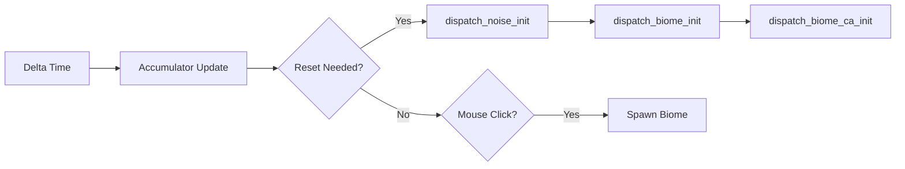
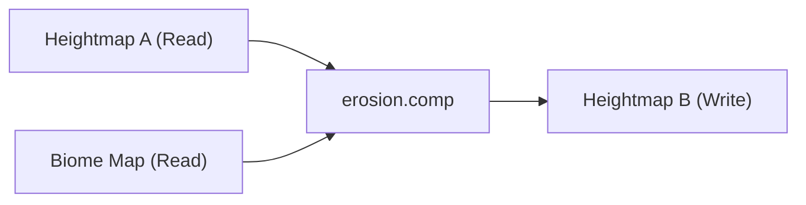
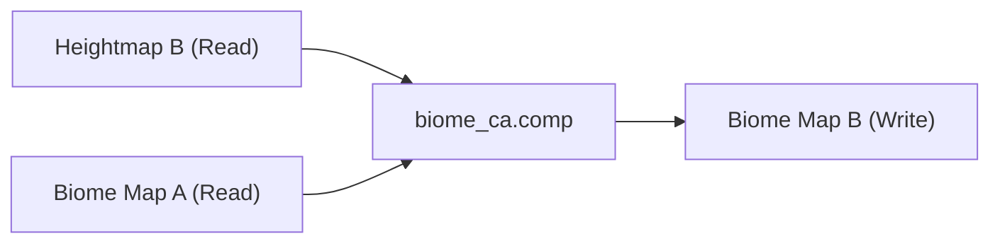
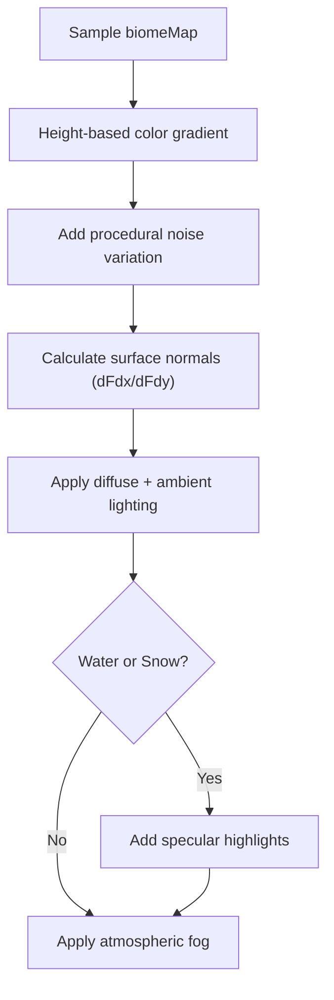

# Living Worlds: Frame Journey Documentation

This document describes the end-to-end journey of each frame in the Living Worlds GPU-accelerated terrain simulation engine.

---

## High-Level Frame Overview


---

## 1. Synchronization Stage

**File:** [living_worlds.cpp](file:///Users/alkhalmr/Documents/LivingWorlds/src/living_worlds.cpp#L1257-L1275)

| Step | Operation | Purpose |
|------|-----------|---------|
| 1.1 | `vkWaitForFences` | Wait for previous frame (N-2) to complete |
| 1.2 | `vkAcquireNextImageKHR` | Get next swapchain image index |
| 1.3 | `vkResetFences` | Reset fence for current frame |
| 1.4 | `vkResetCommandBuffer` | Reset command buffer for reuse |
| 1.5 | `vkBeginCommandBuffer` | Begin recording commands |

---

## 2. Input & State Processing

**File:** [living_worlds.cpp](file:///Users/alkhalmr/Documents/LivingWorlds/src/living_worlds.cpp#L1304-L1325)



| Operation | Description |
|-----------|-------------|
| **Delta Time Calculation** | `glfwGetTime()` difference from last frame |
| **Accumulator Update** | Track time for simulation tick scheduling |
| **Reset Handling** | Regenerate terrain with new seed via noise/biome init shaders |
| **Mouse Spawning** | Copy biome data to GPU texture at click location |

---

## 3. Compute Phase (GPU Simulation)

The compute phase runs the distributed cellular automata simulation on the GPU using ping-pong buffering to prevent read-write conflicts.

### 3.1 Erosion Shader

**File:** [erosion.comp](file:///Users/alkhalmr/Documents/LivingWorlds/shaders/erosion.comp)



| Input | Output | Algorithm |
|-------|--------|-----------|
| `inputHeight` (R32_SFLOAT) | `outputHeight` | Thermal erosion via neighbor averaging |
| `inBiome` (R8_UINT) | — | Biome-specific erosion resistance |

**Key Logic:**
- Calculate neighbor height average
- Apply biome-specific resistance multipliers:
  - Forest: 0.3× (protects terrain)
  - Desert: 1.5× (erodes faster)
  - Sand: 2.5× (coastal erosion)
  - Rock: 0.1× (very resistant)
- Blend current height toward neighbor average

### 3.2 Biome CA Shader

**File:** [biome_ca.comp](file:///Users/alkhalmr/Documents/LivingWorlds/shaders/biome_ca.comp)



| Biome ID | Name | Rules |
|----------|------|-------|
| 0 | Water | Height < 0.30 |
| 1 | Sand | Height 0.30-0.35 |
| 2 | Grass | Default land, transitions to Forest/Desert |
| 3 | Forest | Spreads with 3+ forest neighbors (30% chance) |
| 4 | Desert | Spreads with 3+ desert neighbors |
| 5 | Rock | Height > 0.78 |
| 6 | Snow | Height > 0.85 |
| 7 | Tundra | Transition zone above tree line |
| 8 | Wetland | Near water at low elevation |

**Spreading Rules:**
- Forest/Desert compete for Grass cells
- Coastal areas favor Forest (+50% spread)
- Cluster cells (6+ same neighbors) are highly stable
- Isolated cells (0 same neighbors) die with 10% chance

---

## 4. Memory Barriers

**File:** [living_worlds.cpp](file:///Users/alkhalmr/Documents/LivingWorlds/src/living_worlds.cpp#L1489-L1507)


| Barrier | Source Stage | Destination Stage | Purpose |
|---------|--------------|-------------------|---------|
| Heightmap | `COMPUTE_SHADER` | `VERTEX_SHADER` | Ensure erosion writes visible to vertex shader |
| Biome Map | `COMPUTE_SHADER` | `FRAGMENT_SHADER` | Ensure biome updates visible to fragment shader |

---

## 5. Graphics Phase (Rendering)

### 5.1 Render Pass Begin

**File:** [living_worlds.cpp](file:///Users/alkhalmr/Documents/LivingWorlds/src/living_worlds.cpp#L1512-L1527)

| Clear Value | Component | Value |
|-------------|-----------|-------|
| Color | Sky Blue | (0.35, 0.50, 0.70, 1.0) |
| Depth | Maximum | 1.0 |

### 5.2 Vertex Shader - Height Displacement

**File:** [terrain.vert](file:///Users/alkhalmr/Documents/LivingWorlds/shaders/terrain.vert)


**Outputs to Fragment:**
- `outUV` — Texture coordinates
- `outWorldPos` — World position for fog/lighting
- `outHeight` — Raw height value

### 5.3 Fragment Shader - Biome Coloring

**File:** [terrain.frag](file:///Users/alkhalmr/Documents/LivingWorlds/shaders/terrain.frag)



| Effect | Implementation |
|--------|----------------|
| **Color Gradient** | Blend dark→light variants by height |
| **Noise** | FBM noise ±8% color variation |
| **Lighting** | Directional light (-0.7, -1.0, -0.5) |
| **Specular** | Blinn-Phong for water (64 shininess) and snow (16) |
| **Edge Detection** | Darken biome boundaries by 8% |
| **Fog** | Distance-based blend to sky color (1.5-3.5 range) |

### 5.4 ImGui Overlay

**File:** [living_worlds.cpp](file:///Users/alkhalmr/Documents/LivingWorlds/src/living_worlds.cpp#L1548-L1549)

- Render parameter controls
- Draw ImGui command data
- End render pass

---

## 6. Presentation

**File:** [living_worlds.cpp](file:///Users/alkhalmr/Documents/LivingWorlds/src/living_worlds.cpp#L1558-L1582)


| Operation | Synchronization |
|-----------|-----------------|
| `vkQueueSubmit` | Wait on `image_available_semaphore`, signal `render_finished_semaphore` |
| `vkQueuePresentKHR` | Wait on `render_finished_semaphore` |
| Frame Advance | Increment `current_frame` (mod MAX_FRAMES_IN_FLIGHT) |

---

## 7. Initialization Shaders (Run Once)

These shaders run during world reset, not during the main frame loop.

### 7.1 Noise Initialization

**File:** [noise_init.comp](file:///Users/alkhalmr/Documents/LivingWorlds/shaders/noise_init.comp)


### 7.2 Biome Initialization

Initial biome assignment based on height thresholds:
- Height < 0.30 → Water
- Height < 0.35 → Sand
- Height > 0.85 → Snow
- Height > 0.72 → Rock/Tundra
- Default → Grass

---

## 8. Complete Frame Timeline

```
┌────────────────────────────────────────────────────────────────────────────────┐
│                              FRAME N                                            │
├──────────────┬───────────────────────┬────────────────────┬────────────────────┤
│  CPU Side    │     GPU Compute       │   GPU Graphics     │     Present        │
├──────────────┼───────────────────────┼────────────────────┼────────────────────┤
│ Wait Fence   │                       │                    │                    │
│ Acquire Img  │                       │                    │                    │
│ Reset CmdBuf │                       │                    │                    │
│ Begin Cmd    │                       │                    │                    │
│ ─────────────┼───────────────────────┤                    │                    │
│              │ Erosion Dispatch      │                    │                    │
│              │ ┐ Read Heightmap A    │                    │                    │
│              │ │ Read Biome Map      │                    │                    │
│              │ └ Write Heightmap B   │                    │                    │
│              │ Memory Barrier        │                    │                    │
│              │ Biome CA Dispatch     │                    │                    │
│              │ ┐ Read Heightmap B    │                    │                    │
│              │ │ Read Biome Map A    │                    │                    │
│              │ └ Write Biome Map B   │                    │                    │
│ ─────────────┼───────────────────────┼────────────────────┤                    │
│              │ Pipeline Barrier      │                    │                    │
│ ─────────────┼───────────────────────┼────────────────────┤                    │
│              │                       │ Begin RenderPass   │                    │
│              │                       │ Bind Pipeline      │                    │
│              │                       │ Bind Vertex/Index  │                    │
│              │                       │ Bind Descriptors   │                    │
│              │                       │ DrawIndexed        │                    │
│              │                       │ (9.4M vertices)    │                    │
│              │                       │ ImGui Render       │                    │
│              │                       │ End RenderPass     │                    │
│ ─────────────┼───────────────────────┼────────────────────┼────────────────────┤
│ End CmdBuf   │                       │                    │                    │
│ Queue Submit │                       │                    │                    │
│              │                       │                    │ Queue Present      │
│              │                       │                    │ Signal Fence       │
│ Advance Frame│                       │                    │                    │
└──────────────┴───────────────────────┴────────────────────┴────────────────────┘
```

---

## 9. Key Resources

| Resource | Format | Size | Purpose |
|----------|--------|------|---------|
| **Heightmap** (×2) | R32_SFLOAT | 3072×3072 | Terrain elevation (ping-pong) |
| **Biome Map** (×2) | R8_UINT | 3072×3072 | Biome IDs 0-8 (ping-pong) |
| **Vertex Buffer** | vec2 | 9.4M vertices | Grid mesh positions |
| **Index Buffer** | uint32 | ~56M indices | Triangle list |
| **Uniform Buffer** | struct | Per-frame | MVP matrices, time, viz mode |

---

## 10. Performance Characteristics

| Grid Size | Vertices | Target FPS | Frame Budget |
|-----------|----------|------------|--------------|
| 512×512 | 262K | 3000+ | 0.33 ms |
| 1024×1024 | 1.0M | 1400+ | 0.71 ms |
| 2048×2048 | 4.2M | 500+ | 2.0 ms |
| 3072×3072 | 9.4M | 200+ | 5.0 ms |
