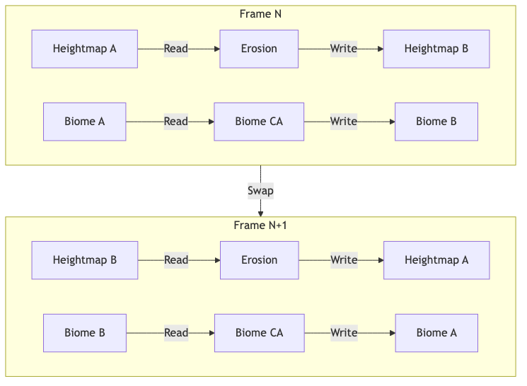
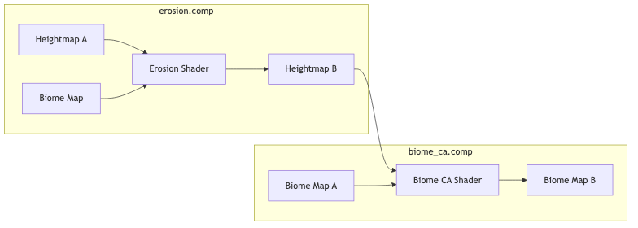

# Living Worlds
## GPU-Accelerated CA Terrain Simulation
### CS380 Final Presentation

**Mohammad Alkhalifah**  
December 2025


<!--
-->

---

# The Problem

## Static Terrain is Boring

- Traditional approach: **Offline generation** or **manual sculpting**
- Games need: **Dynamic, evolving worlds**

### Our Goal
> Real-time terrain simulation using **GPU cellular automata**
> with **interactive framerates**


<!--
This project is about cellular automata - a classic concept in computer science where complex patterns emerge from simple local rules applied repeatedly over a grid.

As you can see in this animation of Conway's Game of Life, cells live or die based on neighbor counts - creating complex "breeder" patterns from simple rules. But CA can model much more: spreading fires, crystal growth, and terrain evolution.

What I built is interactive world generation using CA rules on the GPU. It's not a physics simulation - we're not solving differential equations for water flow. Instead, simple rules like 'mass flows downhill if slope exceeds a threshold' create visually convincing terrain dynamics.
-->

---

# What We Built

## Living Worlds Engine

| Component | Description |
|-----------|-------------|
| **Geological Layer** | Thermal erosion simulation |
| **Ecological Layer** | 9 biome types with spreading rules |
| **Feedback Loop** | Forests stabilize terrain (80% resistance) |
| **Renderer** | 2.5D isometric with atmospheric fog |

<!--
Here's what Living Worlds actually does.

It has two main simulation layers. The geological layer handles thermal erosion - mass flowing downhill based on slope. The ecological layer manages 9 different biome types, each with their own spreading rules.

The key insight is the feedback loop between these layers. Forests actually stabilize the terrain - they reduce erosion by 80%. So where forests grow, mountains stay tall. Where deserts spread, erosion accelerates.

All of this is rendered in a 2.5D isometric view with atmospheric fog for depth.
-->

---

# GPU Architecture

<div class="columns">
<div>

## Frame Pipeline


## Ping-Pong Buffering


</div>
<div>

### Why Ping-Pong?
- Prevents **race conditions** in parallel updates
- Each frame: Read A → Write B → Swap
- Essential for cellular automata correctness

### Frame N vs N+1
- Frame N: Read A, Write B
- Frame N+1: Read B, Write A
- Buffers alternate each frame

</div>
</div>

<!--
Let me explain the GPU architecture using these two diagrams.

The top diagram shows the frame pipeline - each frame goes through six stages: Synchronization for GPU timing, Input processing for user controls, Compute phase for simulation, Memory barriers for sync, Graphics for rendering, and Presentation to display.

The bottom diagram illustrates ping-pong buffering. In Frame N, we read from buffer A and write to buffer B. In Frame N+1, we swap - reading from B and writing to A. This alternation continues every frame.

Why is this essential? In cellular automata, every cell reads its neighbors. If we update in-place, some threads read old values while others read new values - that's a race condition. Ping-pong ensures all threads read the same consistent state.
-->

---

# Compute Phase: Data Flow

## Erosion → Biome CA Pipeline



### Why Compute Shaders?
- **Parallel**: 9.4M threads simultaneously
- **Local**: Each cell only reads neighbors, no global sync

<!--
Here's how data flows through the compute phase each frame.

First, the erosion shader reads the current heightmap and biome map, then writes an updated heightmap. Then the biome CA shader reads the updated heightmap and current biome state, writing new biome assignments.

This runs on 9.4 million threads in parallel - one per cell - with no global synchronization needed.
-->

---

# Cellular Automata Rules

<div class="columns">
<div>

## Erosion (Diffusion)
*Each cell moves toward neighbor average*
```glsl
float neighborAvg = avgOf8Neighbors();
newH = h + (neighborAvg - h) * rate;
```

## Biome Feedback
*Biomes modify erosion rate*
```glsl
if (biome == FOREST) 
    rate *= forestMult; // UI: 0.2
if (biome == DESERT) 
    rate *= desertMult; // UI: 1.5
```

</div>
<div>

## Biome Spreading
*Height thresholds + neighbor counting*
```glsl
if (h < 0.30) biome = WATER;
if (h > 0.85) biome = SNOW;
if (forestNeighbors >= threshold)
    if (rand() < forestChance)
        biome = FOREST;
```

</div>
</div>

<!--
Let me walk through the actual rules in the compute shaders.

For erosion, we calculate the average height of all 8 neighbors, then move each cell's height toward that average. The rate is controlled by a slider in the UI.

The biome-erosion coupling modifies this rate based on biome type. Forests reduce erosion to 20% of normal. Deserts erode 50% faster.

For biome spreading, the rules are based on neighbor counting. Grass becomes forest if it has enough forest neighbors and passes a probability check.
-->

---

# Biome System

<!-- Slide 6: Reduced font size for table fit -->
<style scoped>
table { font-size: 18px; }
</style>

## 9 Discrete Biome Types

| Biome | Behavior |
|-------|----------|
| 🌊 Water | Height < 0.3 (forced) |
| 🏖️ Sand | Coastal zones |
| 🌱 Grass | Default land, converts to forest |
| 🌲 Forest | Spreads, resists erosion |
| 🏜️ Desert | Spreads in dry areas |
| 🪨 Rock | High elevation (>0.8) |
| ❄️ Snow | Peaks (>0.85) |
| 🏔️ Tundra | Alpine transition |
| 💧 Wetland | Low areas near water |

<!--
Here are the 9 biome types in the system.

Water is forced below a certain height. Sand appears in coastal zones. Grass is the default land cover and can convert to forest.

Forest is the key biome - it spreads to neighbors and resists erosion. Desert spreads in dry areas and accelerates erosion.

At high elevations we have rock, snow on peaks, tundra as a transition zone, and wetlands in low areas near water.
-->

---

# Performance Results

## Benchmark: FPS vs Grid Size

<div class="columns">
<div>


</div>
<div>

| Grid | Vertices | FPS |
|------|----------|-----|
| 512² | 262K | 3,062 |
| 1024² | 1.0M | 1,414 |
| 2048² | 4.2M | 505 |
| **3072²** | **9.4M** | **243** |

</div>
</div>

<!--
Let's talk performance.

I benchmarked on an RTX 2080 across four grid sizes. At 512x512 - that's 262,000 cells - we hit over 3,000 FPS. At 1024x1024, about 1,400 FPS.

Even at 3072x3072 - that's 9.4 million vertices being simulated and rendered - we maintain 243 FPS. That's well above the 60 FPS target for interactive applications.

The key insight from this chart is that FPS scales linearly with grid area. Doubling the grid dimensions means roughly quartering the FPS, which is expected behavior for a GPU-bound workload.
-->

---

# Scalability Analysis

## FPS vs Simulation Speed

<div class="columns">
<div>


</div>
<div>

### Key Findings
- FPS decreases linearly with compute load
- 1000× sim speed costs ~30% FPS
- Interactive performance maintained

</div>
</div>

<!--
This chart shows what happens when we increase simulation speed.

At higher simulation speeds, we run more compute iterations per rendered frame. At 1000x speed, we see about a 30% FPS reduction.

But even at extreme simulation speeds, performance remains interactive. The system is well-optimized for the GPU's parallel architecture.
-->

---

# Demo Video

## Walkthrough

*Terrain generation, camera control, biome spawning, real-time CA parameter changes, and erosion dynamics.*

<!--
Let me show you a quick demo of the system in action.

[Play walkthrough_demo.mp4]

You can see terrain generation from noise, camera controls for navigation, spawning biomes with mouse clicks, and crucially - real-time parameter adjustment. I can change erosion rates, biome spreading probabilities, all while the simulation keeps running.
-->

---

# Future Work

- **Hydraulic erosion** - water flow simulation
- **Infinite terrain** - chunked streaming
- **Advanced lighting** - shadows, ambient occlusion

<!--
For future work, the main addition would be hydraulic erosion - simulating actual water flow and sediment transport, not just mass movement.

Infinite terrain using chunked streaming would allow much larger worlds.

And advanced lighting with shadows and ambient occlusion would significantly improve visual quality.
-->

---

# Thank You!

## Questions?
**Repository:**
[github.com/mkhlf/livingworlds](https://github.com/mkhlf/livingworlds)


<!--
That's Living Worlds. The code is available on GitHub at this repository.

Thank you for listening. I'd be happy to take any questions.
-->
