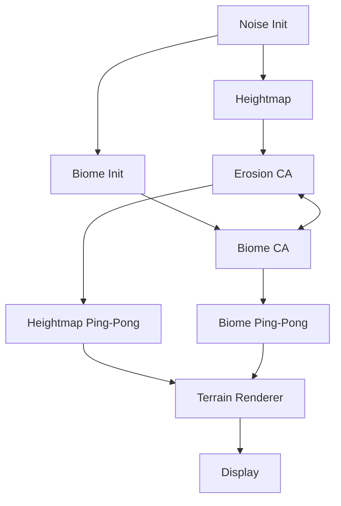

# Living Worlds - Comprehensive Technical Documentation

## Project Overview

**Living Worlds** is a GPU-accelerated procedural terrain simulation using Vulkan compute shaders. It implements cellular automata for biome dynamics and thermal erosion running at 3072×3072 resolution (~9.4M vertices) at 180+ FPS.

---

## Architecture



### Render Pipeline
1. **Compute Phase**: Erosion + Biome CA (ping-pong buffers)
2. **Graphics Phase**: Terrain mesh rendering with displacement
3. **UI Phase**: ImGui overlay

---

## Shaders

### 1. Noise Initialization (`noise_init.comp`)
Generates initial heightmap using Fractal Brownian Motion (FBM).

```glsl
// 6-octave FBM for natural terrain
float fbm(vec2 p) {
    float v = 0.0;
    float a = 0.5;
    mat2 rot = mat2(cos(0.5), sin(0.5), -sin(0.5), cos(0.5));
    for (int i = 0; i < 6; i++) {
        v += a * noise(p);
        p = rot * p * 2.0 + vec2(100.0);
        a *= 0.5;
    }
    return v;
}
```

---

### 2. Erosion (`erosion.comp`)
Thermal erosion with biome-aware resistance.

```glsl
// Biome erosion multipliers
float multiplier = 1.0;
if (biome == FOREST && params.bidrEnabled > 0.5) {
    multiplier = params.forestMult;  // Default: 0.3 (resistant)
} else if (biome == DESERT) {
    multiplier = params.desertMult;  // Default: 1.5 (more erosion)
} else if (biome == SAND && hasWaterNeighbor) {
    multiplier = params.sandMult * params.coastalBonus; // Coastal erosion
}

// Sigmoid scaling to prevent > 1.0
float scaledMult = multiplier / (1.0 + abs(multiplier - 1.0) * 0.5);
float finalRate = params.rate * clamp(scaledMult, 0.05, 0.95);
```

---

### 3. Biome Cellular Automata (`biome_ca.comp`)
9-state discrete CA with height-based constraints.

#### Biome IDs
| ID | Biome | Height Range |
|----|-------|--------------|
| 0 | Water | < 0.30 |
| 1 | Sand | 0.25 - 0.35 |
| 2 | Grass | 0.30 - 0.72 |
| 3 | Forest | 0.30 - treeLineHeight |
| 4 | Desert | 0.30 - 0.72 |
| 5 | Rock | > 0.80 |
| 6 | Snow | > 0.85 |
| 7 | Tundra | 0.72 - 0.85 |
| 8 | Wetland | < 0.40 (near water) |

#### Key CA Rules
```glsl
// Forest spreading (neighbor count >= threshold)
if (current == GRASS && forestCount >= pc.forestThreshold) {
    if (rF < 0.1) newBiome = FOREST;
}

// Tree line: forest above height becomes tundra
if (current == FOREST && h > pc.treeLineHeight) {
    if (rT < pc.tundraSpreadRate) newBiome = TUNDRA;
}

// Mountain zone priority
if (h > 0.85) newBiome = SNOW;
else if (h > 0.80) newBiome = ROCK;
else if (h > 0.72) newBiome = TUNDRA;
```

---

### 4. Terrain Vertex Shader (`terrain.vert`)
Height displacement and normal calculation.

```glsl
void main() {
    vec2 inPos = inPosition;
    vec2 localPos = inPos - 0.5; // Center at origin (-0.5 to 0.5)
    
    float h = texture(heightMap, inPos).r;
    float height = h * heightScale; // Scale: 0.3
    
    // Displaced position
    vec3 displacedPos = vec3(localPos.x, height, localPos.y);
    
    // Normal from height gradient
    float hL = texture(heightMap, inPos - vec2(texelSize.x, 0)).r;
    float hR = texture(heightMap, inPos + vec2(texelSize.x, 0)).r;
    float hD = texture(heightMap, inPos - vec2(0, texelSize.y)).r;
    float hU = texture(heightMap, inPos + vec2(0, texelSize.y)).r;
    
    vec3 normal = normalize(vec3(hL - hR, 2.0 * texelSize.y, hD - hU));
}
```

---

### 5. Terrain Fragment Shader (`terrain.frag`)
Biome coloring, lighting, and atmospheric effects.

#### Biome Colors
```glsl
// Light variants (high elevation)
const vec3 biomeColorsLight[9] = vec3[](
    vec3(0.2, 0.45, 0.9),   // Water - Bright Blue
    vec3(1.0, 0.95, 0.8),   // Sand - Light Cream
    vec3(0.45, 0.75, 0.35), // Grass - Bright Green
    vec3(0.2, 0.5, 0.15),   // Forest - Medium Green
    vec3(0.95, 0.7, 0.45),  // Desert - Light Orange
    vec3(0.6, 0.58, 0.55),  // Rock - Light Gray
    vec3(1.0, 1.0, 1.0),    // Snow - White
    vec3(0.7, 0.6, 0.45),   // Tundra - Tan
    vec3(0.25, 0.55, 0.45)  // Wetland - Teal
);
```

#### Sky Gradient
```glsl
vec3 skyZenith = vec3(0.25, 0.45, 0.75);   // Deep blue overhead
vec3 skyHorizon = vec3(0.35, 0.50, 0.70);  // Medium blue at horizon
vec3 groundHaze = vec3(0.40, 0.55, 0.70);  // Ground haze

vec3 viewDir = normalize(inWorldPos - cameraPos);
float skyFactor = clamp(-viewDir.y * 2.0 + 0.3, 0.0, 1.0);
vec3 skyColor = mix(groundHaze, mix(skyHorizon, skyZenith, skyFactor), skyFactor);

// Distance fog
float fogFactor = clamp((dist - 0.8) / 1.7, 0.0, 0.7);
finalColor = mix(finalColor, skyColor, fogFactor);
```

---

## Camera System

### Isometric Mode (Default)
- **Pitch**: -45° (adjustable via UI slider)
- **Yaw**: 45° (rotates with Q/E)
- **Pan**: WASD (screen-relative)
- **Zoom**: Z/X keys

```cpp
glm::mat4 Camera::getIsometricViewMatrix() {
    float pitchRad = glm::radians(isoPitch);
    float yawRad = glm::radians(isoYaw);
    
    glm::vec3 target(targetPos.x - 0.5f, 0.0f, targetPos.y - 0.5f);
    
    float camX = target.x + zoomDistance * cos(pitchRad) * sin(yawRad);
    float camY = target.y - zoomDistance * sin(pitchRad);
    float camZ = target.z + zoomDistance * cos(pitchRad) * cos(yawRad);
    
    return glm::lookAt(glm::vec3(camX, camY, camZ), target, glm::vec3(0,1,0));
}
```

### Free 3D Mode
- Toggle: **V** key
- Mouse look + WASD + Q/E up/down

---

## UI Controls (ImGui)

| Section | Controls |
|---------|----------|
| **Simulation** | Pause, Speed slider, Reset |
| **Erosion** | Rate, Forest/Desert/Sand multipliers |
| **Biome** | Forest/Desert chances, thresholds |
| **Wetland** | Formation rate, spread rate, max height |
| **Mountain** | Snow melt/spread, Tundra spread, Tree line |
| **Camera** | Pitch slider (-80° to -20°) |

---

## Performance Optimizations

### Applied
1. **Duplicate barrier removed**: Was calling same barrier twice
2. **Pre-computed inverse view**: `invView` in UBO instead of per-fragment `inverse()`
3. **Frame skip for efficiency**: Workgroup size 16×16 = 256 threads

### Key Metrics
- Grid: 3072×3072 (9.4M vertices)
- FPS: 180-200 (no recording)
- Simulation: Configurable updates/sec

---

## Keyboard Shortcuts

| Key | Action |
|-----|--------|
| Tab | Toggle UI |
| Space | Pause/Resume |
| R | Reset terrain |
| V | Toggle camera mode |
| WASD | Pan (isometric) / Move (3D) |
| Q/E | Rotate (isometric) / Up/Down (3D) |
| Z/X | Zoom in/out |

---

## Build & Run

```bash
cd build
cmake ..
make -j4
./bin/LivingWorlds
```

## File Structure

```
livingworlds/
├── src/
│   ├── living_worlds.cpp    # Main application (~2460 lines)
│   ├── living_worlds.hpp    # Headers + Camera class
│   └── main.cpp
├── shaders/
│   ├── noise_init.comp      # FBM heightmap generation
│   ├── erosion.comp         # Thermal erosion CA
│   ├── biome_ca.comp        # 9-state biome CA
│   ├── terrain.vert         # Height displacement
│   └── terrain.frag         # Biome colors + sky gradient
├── external/
│   └── imgui/               # Dear ImGui
└── CMakeLists.txt
```
