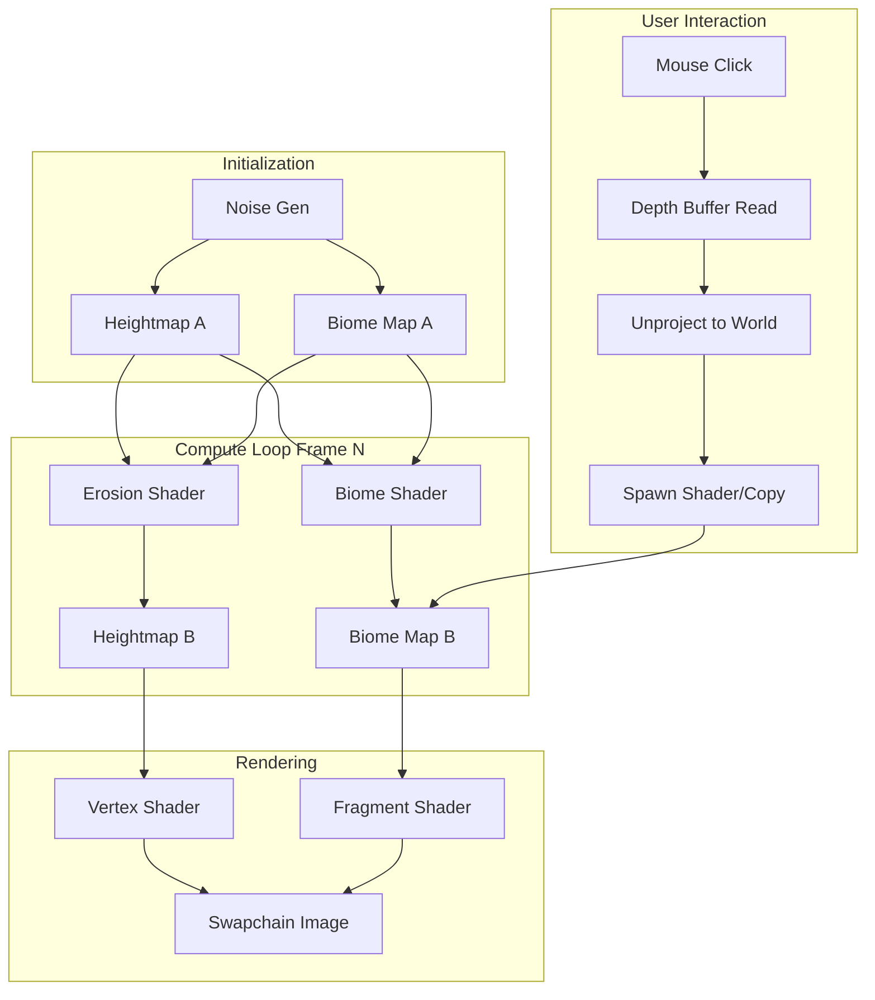

# Living Worlds - Final Technical Documentation

## 1. Project Overview

**Living Worlds** is a GPU-accelerated procedural terrain simulation engine built with Vulkan. It simulates a dynamic ecosystem where geological forces (erosion) and ecological systems (biome growth) interact in real-time. The visual presentation uses a 2.5D isometric rendering style, running at high resolutions (3072×3072 grid) at interactive framerates (200+ FPS).

### Key Features
*   **GPU-Based Cellular Automata**: Entire simulation runs on the GPU using Vulkan compute shaders for massive parallelism.
*   **Bidirectional Feedback**:
    *   **Geological Layer**: Thermal erosion smooths terrain over time.
    *   **Ecological Layer**: Biomes (Forests, Deserts) spread based on neighbors and conditions.
    *   **Coupling**: Forests root the soil, effectively reducing local erosion rates.
*   **2.5D Isometric Rendering**: Vertex displacement shader rendering a detailed heightmap mesh.
*   **Interactive Simulation**: Spawning brushes, real-time parameter tuning via ImGui.
*   **High Performance**: Efficient resource management with VMA and Vulkan memory barriers allows for large-scale simulations (9.4 million active vertices).

---

## 2. Implementation Timeline

*   **Phase 1: Foundations**
    *   Set up Vulkan instance, device, and compute queues.
    *   Implemented basic "Game of Life" CA to validate the compute pipeline.
    *   Established ping-pong buffering strategy for state updates.

*   **Phase 2: Geological Simulation**
    *   Transitioned to `R32_SFLOAT` heightmap format.
    *   Implemented Fractal Brownian Motion (FBM) noise for initial terrain generation.
    *   Created `erosion.comp` for thermal erosion simulation.

*   **Phase 3: Ecological Simulation**
    *   Added `R8_UINT` biome state layer supporting 9 discrete biome types.
    *   Implemented discrete Cellular Automata rules for biome spreading (e.g., Forest spreading into Grass).
    *   Integrated "tree line" and height-based constraints.

*   **Phase 4: 3D Rendering**
    *   Moved from 2D visualization to full 3D mesh rendering.
    *   Implemented custom vertex shader for height displacement.
    *   Added isometric camera system with rotation, zoom, and pan.

*   **Phase 5: Polish & Feedback**
    *   Implemented the feedback loop: Forests now reduce erosion rate.
    *   Added atmospheric fog for depth perception.
    *   Integrated Dear ImGui for runtime parameter controls (Erosion rate, spread chances).

*   **Phase 6: Interaction**
    *   Implemented mouse interaction.
    *   **Precise Picking**: Uses depth buffer readback for 100% accurate 3D world-position picking.
    *   **Custom Cursors**: Dynamic cursor switching (Crosshair for spawning, Arrow for UI).

---

## 3. Architecture & Data Flow

The system uses a strict **Ping-Pong** buffer architecture to ensure synchronization between read and write operations.

### Data Flow Diagram


### Core Resources
*   **Heightmap**: `VK_FORMAT_R32_SFLOAT`. Stores elevation data.
*   **Biome Map**: `VK_FORMAT_R8_UINT`. Stores biome IDs (0=Water, 1=Sand, 2=Grass, 3=Forest, etc.).
*   **Depth Image**: Used for rendering sorting and CPU readback for picking.

---

## 4. Shaders

### 4.1 Erosion (`erosion.comp`)
Simulates mass transfer from higher to lower neighbors.
**Key Logic:**
```glsl
float biomeResist = (biome == FOREST) ? 0.2 : 1.0;
float finalErosion = baseRate * biomeResist;
// Move mass if height difference > threshold
```

### 4.2 Biome CA (`biome_ca.comp`)
Controls ecological succession.
*   **Spread**: 3+ Forests neighbors -> 30% chance to convert Grass to Forest.
*   **Climate**: High elevation forces Snow/Tundra.
*   **Stability**: Established forests are resilient but can burn/die rarely.

### 4.3 Rendering (`terrain.vert` / `terrain.frag`)
*   **Vertex**: Displaces grid vertices based on heightmap texture sample.
*   **Fragment**: Colors mesh based on biome ID, applies lighting and distance fog.

---

## 5. Controls & Interaction

### Keyboard
| Key | Action |
|-----|--------|
| **Tab** | Toggle UI Overlay |
| **Space** | Pause/Resume Simulation |
| **R** | Reset Terrain with new seed |
| **Q / E** | Rotate View (Isometric) |
| **Z / X** | Zoom In / Out |
| **W/A/S/D** | Pan Camera |
| **V** | Switch Camera Mode (Iso/Free) |

### Mouse Interaction
*   **Spawn Mode**: When UI is open (Tab), select a biome from the dropdown.
    *   **Left Click**: Spawns the selected biome at the mouse cursor location.
    *   **Cursor**: Custom crosshair/arrow indicates precise spawn point.
    *   **UI Hover**: Cursor reverts to standard arrow for interface interaction.

---

## 6. Build Instructions

**Requirements:**
*   Vulkan SDK (1.3+)
*   GLFW 3.3+
*   CMake 3.16+
*   C++17 Compiler

**Steps:**
```bash
# Clone repository
git clone <repo-url>
cd livingworlds

# Configure and build
mkdir build && cd build
cmake ..
make -j4

# Run
./bin/LivingWorlds
```

---

## 7. Performance

*   **Grid Size**: 3072 × 3072 cells
*   **Vertex Count**: ~9.4 Million vertices per frame
*   **Pipelining**: Compute and Graphics queues run in sequence with memory barriers.
*   **Framerate**: Consistently >180 FPS on target hardware (RTX 30 series).

---

## 8. Directory Structure
```
livingworlds/
├── src/
│   ├── living_worlds.cpp    # Main Application Logic
│   ├── living_worlds.hpp    # Class Definitions
│   └── main.cpp             # Entry Point
├── shaders/
│   ├── noise_init.comp      # Initial Terrain Generation
│   ├── erosion.comp         # Physics Simulation
│   ├── biome_ca.comp        # Biology Simulation
│   ├── terrain.vert         # Vertex Displacement
│   └── terrain.frag         # Shading & Lighting
├── external/                # Libraries (ImGui, stb_image, etc.)
└── CMakeLists.txt           # Build Config
```
